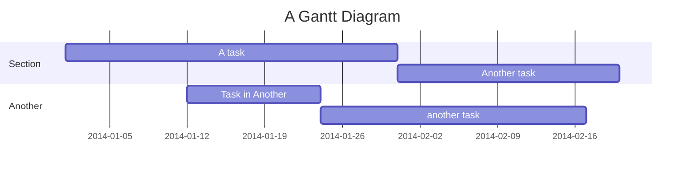

## ガントチャートの作成

###### 上記のガントチャートのコードは下記の通りです。
```
gantt
    title A Gantt Diagram
    dateFormat YYYY-MM-DD
    section Section
        A task          :a1, 2014-01-01, 30d
        Another task    :after a1, 20d
    section Another
        Task in Another :2014-01-12, 12d
        another task    :24d
```
###### マイルストーン
図にマイルストーンを追加できます。マイルストーンは、単一の瞬間を表し、キーワードによって識別されるため、タスクとは異なりますmilestone。以下にマイルストーンの使用例を示します。お気づきかと思いますが、マイルストーンの正確な位置は、マイルストーンの最初の日付とタスクの「期間」によって決まります (最初の日付+期間/2)。

コード：
```
gantt
    dateFormat HH:mm
    axisFormat %H:%M
    Initial milestone : milestone, m1, 17:49, 2m
    Task A : 10m
    Task B : 5m
    Final milestone : milestone, m2, 18:08, 4m
```

```mermaid
gantt
    dateFormat HH:mm
    axisFormat %H:%M
    Initial milestone : milestone, m1, 17:49, 2m
    Task A : 10m
    Task B : 5m
    Final milestone : milestone, m2, 18:08, 4m
```

##### 日付の設定
dateFormatガント要素の日付入力の形式を定義します。レンダリングされたグラフ出力でこれらの日付がどのように表現されるかは、 によって定義されますaxisFormat。

###### 入力日付形式
デフォルトの入力日付形式は ですYYYY-MM-DD。カスタム を定義できますdateFormat。
```
dateFormat YYYY-MM-DD
```
以上がガントチャートのチュートリアルです。